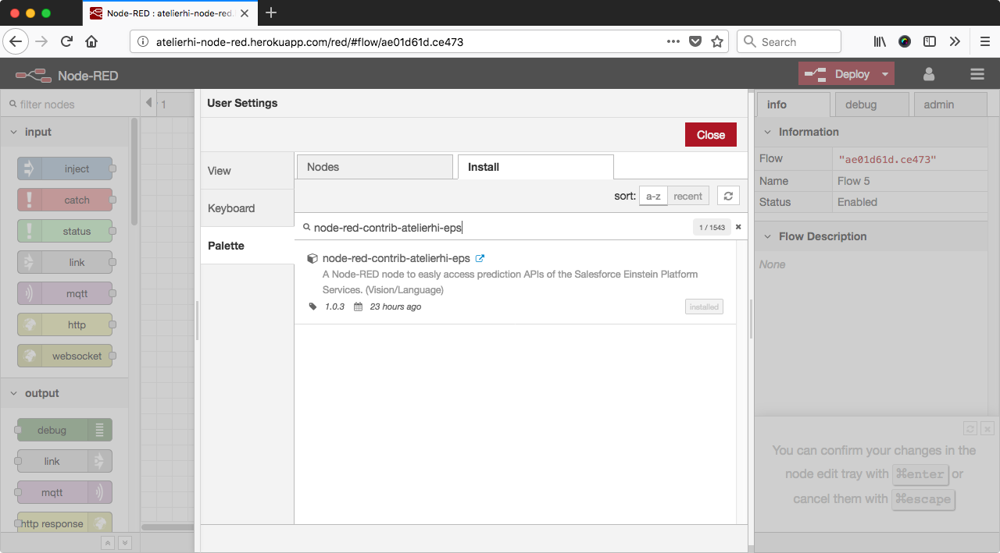

# Node-RED 用 Einstein Platform Services ノード
## 概要
Node-RED で Salesforce が提供する画像認識や自然言語処理の AI 機能である Einstein Platform Services を簡単に使えるようにする追加ノードです。  
注意: このサンプルコードは、あくまで機能利用の1例を示すためのものであり、コードの書き方や特定ライブラリの利用を推奨したり、機能提供を保証するものではありません。
## 利用方法(Node-RED "パレットの管理"からのインストール)
* Menu -> Manage Palette -> Palette -> Install 次の文字列で検索し install をクリック
```
node-red-contrib-atelierhi-eps
```

## 利用方法(Github からソースコードをダウンロードしインストール)
### 1. 「Einstein Platform Services ノード」を Github からダウンロード
1. $ cd [ワーク用ディレクトリに移動]
2. $ git clone https://github.com/hinabasfdc/node-red-contrib-atelierhi-eps.git
3. $ cd node-red-contrib-atelierhi-eps
4. $ npm install
### 2. Node-RED で使えるように設定
1. (1-3.で移動したディレクトリで操作)
2. $ npm link
3. $ cd ~/.node-red
4. $ npm link node-red-contrib-atelierhi-eps

以上の操作で、Node-REDを起動するとパレットに「Einstein Platform Services」が出現します。  
パレットからワークスペースにドラッグし、"Account ID"と"Private Key"の二つを設定してください。

### Einstein Platform Services のアカウント取得
Salesforce Lightning Platform のアカウントに紐付け、あるいは、Heroku のアドオンとして払い出し、の2パターンがあります。  
これから取得されるということであれば、Heroku のアドオンとして払い出しをお勧めします。

1. Heroku アカウントを作成 & クレジットカード情報を登録 (https://signup.heroku.com/jp)
2. 何らかのアプリケーションを作成
3. Einstein Vision アドオン(Free版で良い)をアプリケーションに追加(https://elements.heroku.com/addons/einstein-vision)
4. アプリケーションの Settings -> Config Vars から Einstein Platform Services の Account ID と Private Key 情報を取得

## テストフローの作成:その1(API Usage)
1. 「injection」ノード
    1. Timestampのまま特に変更なし
2. 「function」ノード
    1. Name
        1. Test Api Usage
    2. Function 
        ```
        msg.eps = {};
        msg.eps.feature = "APIUSAGE";
        return msg;
        ```
3. 「Einstein Platform Services」ノード
    1. 手順2の通り
4. 「debug」ノード
    1. 特に設定変更なし
5. 1→2、2→3、3→4と接続
6. 配置と設定が完了したら、画面右上にある「Deploy」ボタンを押してロジックを公開
7. 公開が完了したら、「インジェクション」ノードの左のボタンをクリックして、動作を確認
8. 画面右ペインの「debug」タブで、ライセンスやAPI使用状況に関する情報が表示されたら動作成功

## テストフローの作成:その2(Image Classification)
1. 「injection」ノード
    1. Timestampのまま特に変更なし
2. 「function」ノード
    1. Name
        1. Test Prediction
    2. Function
        ```
        msg.eps = {};
        msg.eps.sampleLocation = "https://upload.wikimedia.org/wikipedia/commons/d/d3/Supreme_pizza.jpg";
        msg.eps.modelid = "FoodImageClassifier";
        return msg;
        ```
3. 「Einstein Platform Services」ノード
    1. 手順2の通り
4. 「debug」ノード
    1. 特に設定変更なし
5. 1→2、2→3、3→4と接続
6. 配置と設定が完了したら、画面右上にある「Deploy」ボタンを押してロジックを公開
7. 公開が完了したら、「インジェクション」ノードの左のボタンをクリックして、動作を確認
8. 画面右ペインの「debug」タブで、”pizza”の予測結果が確認できたら動作成功

## 仕様
### ノードのパラメーター
* Name
    * 表示名
* URL
    * Einstein Platform Services のAPI起点(特に変更の必要なし。必ず最後に/をつける)
* Default Feature
    * ノードの入力から実行する機能の指定がない場合に使われる機能(初期設定は画像仕分けのImage Classification)
    * 設定可能値
        * IMAGECLASSIFICATION
        * OBJECTDETECTION
        * SENTIMENT
        * INTENT
* Default ModelId
    * ノードの入力から使用するモデルの指定がない場合に使われるモデルID(初期設定は GeneralImageClassifier)
* Account ID
    * Einstein Platform Services のアカウントID
* Private Key
    * Einstein Platform Services のアカウントIDに紐づくプライベートKEY

### ノードの入力
原則として msg オブジェクトに情報を追記

* msg.eps.feature
    * Einstein Platform Services の何の機能を使用するか指定する。次の4つから選択する。
        * APIUSAGE
        * IMAGECLASSIFICATION
        * OBJECTDETECTION
        * SENTIMENT
        * INTENT
* msg.eps.modelid
    * 使用するモデルIDを指定する
* msg.eps.sampleBase64Content
    * IMAGECLASSIFICATION/OBJECTDETECTIONの場合に使用
    * 画像をbase64でエンコードした文字列を設定する
* msg.eps.sampleLocation
    * IMAGECLASSIFICATION/OBJECTDETECTIONの場合に使用
    * 画像の URL を設定する
* msg.eps.document
    * SENTIMENT/INTENTの場合に使用
    * テキストを設定する

### ノードの出力
* msg.payload
    * Einstein Platform Services の返り値(JSON)がそのまま、あるいは、ノードの実行エラー情報がJSON形式で格納される